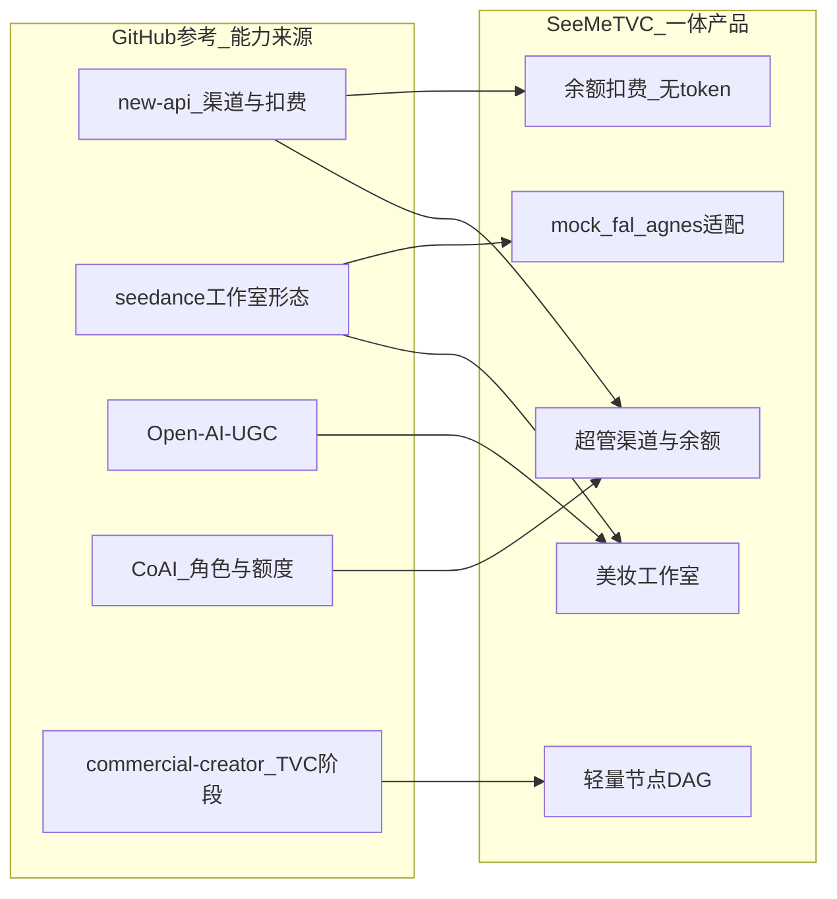
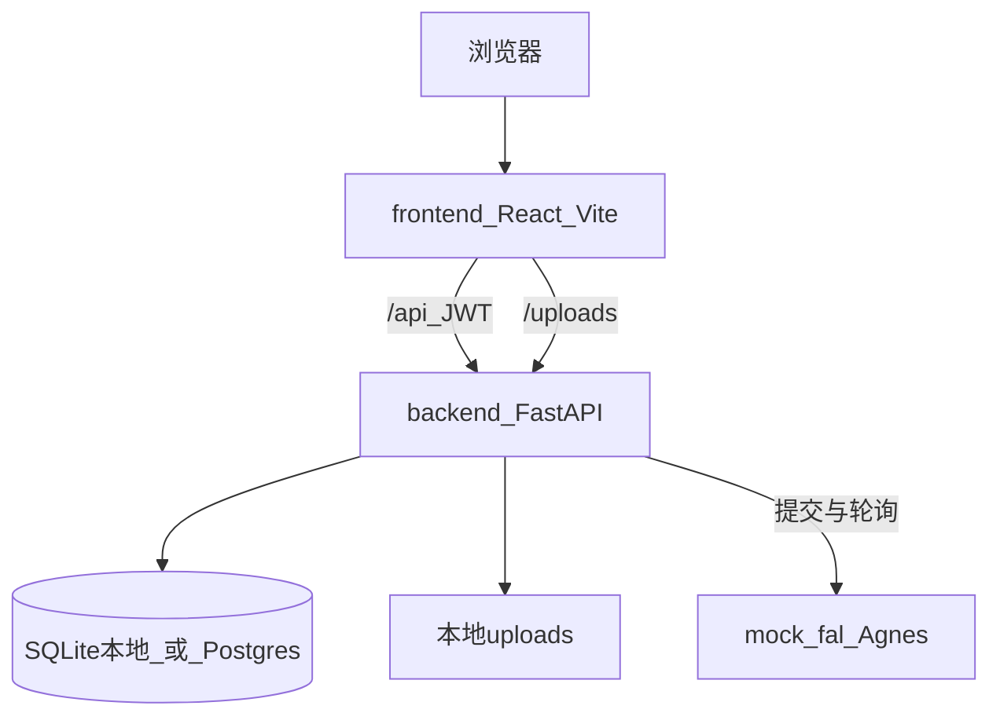
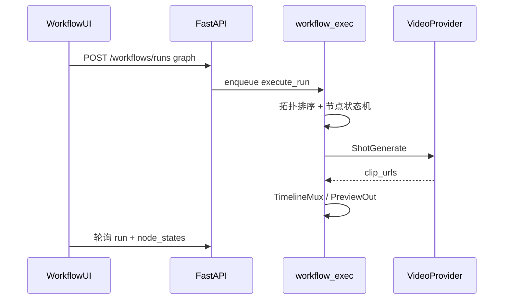

# SeeMeTVC 细化方案

> 状态：**美妆 TVC MVP 已可用**（FastAPI + React 一体单仓）。  
> 原则：**参考开源能力，内嵌进一个完整项目**；不分布式挂载 new-api / 不嵌入完整 ComfyUI。  
> 对齐：[项目计划书.md](项目计划书.md) 中的 Brief → 多场景 → 妆前妆后 → 成片方向；当前以「工作室一键出片 + 轻量节点工作流」双轨落地。

---

## 1. 目标与边界

### 1.1 要做什么

| 能力 | 说明 |
|------|------|
| 前后端分离 | 代码上 `frontend/` + `backend/`；部署一体（compose 或本地双进程） |
| 美妆工作室 | 素材墙选镜 → 提示词 / 参考图（URL 或本地上传）→ 时长 → 并行生成 → 成片播放；可「回到素材」 |
| 轻量节点工作流 | 交互像 ComfyUI 的 DAG 画布（React Flow），节点集合按美妆 TVC 裁剪；**不**嵌入 ComfyUI 进程 |
| 多上游视频 | `mock` 联调、`fal`（Seedance 等）、`agnes` / Pavo 免费渠道 |
| 用户侧余额 | 只展示余额、消耗、余额变化；**不展示 token** |
| 超管渠道 | 添加/改 Key/启停上游（API Key、模型、每秒扣费、优先级） |
| 一体交付 | 一个仓库、一套编排；不为计费再拆第二个网关服务 |

### 1.2 明确不做（当前阶段）

- 不部署独立 `new-api` / One API 作为计费层
- 不嵌入完整 ComfyUI（权重、自定义 Python 节点、任意图兼容）
- 不做后台 token 审计 / 明细账本 UI
- 不做 Stripe / 第三方支付（余额由超管设置）
- 不做通用任意自定义节点；不做本地 SD/视频大模型权重托管
- TimelineMux 暂不做真 ffmpeg 拼接（输出片段列表 + 主预览 URL）

---

## 2. 五个 GitHub 参考项目

以下五个项目是方案与实现的主要参考来源。**只吸收能力与交互模型，不作为运行时依赖。**

| # | 项目 | 链接 | 参考什么 | 本项目如何吸收 |
|---|------|------|----------|----------------|
| 1 | **new-api** | [QuantumNous/new-api](https://github.com/QuantumNous/new-api) | 超管「渠道」：多上游 Key、模型映射、启停/优先级、按量扣费 | 内嵌 `Channel` + `/api/admin/channels`；**不**单独跑 new-api |
| 2 | **seedance-2-generator** | [SamurAIGPT/seedance-2-generator](https://github.com/SamurAIGPT/seedance-2-generator) | 在线工作室、t2v/参考图、异步任务、积分式消费 UX | 工作室页 + 生成/轮询；积分改为「余额」；去掉 Stripe |
| 3 | **Open-AI-UGC** | [Anil-matcha/Open-AI-UGC](https://github.com/Anil-matcha/Open-AI-UGC) | 自托管 UGC/广告短片工作室形态 | 工作室 / 作品 / 素材；模型来自已启用渠道 |
| 4 | **CoAI（原 ChatNio）** | [coaidev/coai](https://github.com/coaidev/coai) | 前后端可分离、超管后台、按用户额度 | 角色 `super_admin` / `user`；超管改余额 |
| 5 | **commercial-creator** | [cxbxmxcx/commercial-creator](https://github.com/cxbxmxcx/commercial-creator) | TVC 阶段划分、成片与费用闸门 | 工作流节点对齐 Brief→分镜→妆容→生成→拼接；仍走同一余额模型 |

### 2.1 参考关系示意



### 2.2 为何不是「拼仓库部署」

| 方式 | 问题 |
|------|------|
| new-api + 前端分部署 | 运维两套，密钥/用户体系割裂 |
| 直接 fork seedance-2-generator | 缺超管多渠道；Stripe 与「余额」语义不符 |
| 嵌入完整 ComfyUI | 权重/自定义节点/安全面过重；与余额渠道难对齐 |
| 直接用 commercial-creator | 管线过重，MVP 不宜一口气做满 |

结论：五个项目是**设计输入**；产出是 **SeeMeTVC 单仓**。节点工作流「像 ComfyUI」，协议与节点按美妆广告片裁剪。

---

## 3. 当前技术架构

### 3.1 总览



| 层 | 技术 | 职责 |
|----|------|------|
| 前端 | React 19 + Vite + React Router + React Flow | 登录、工作室、工作流画布、素材、作品、超管 |
| 后端 | FastAPI + SQLAlchemy asyncio | 鉴权、渠道、余额、任务、工作流执行、上传 |
| 数据 | 本地 SQLite；compose 用 Postgres 16 | 用户、渠道、视频任务、工作流草稿/运行 |
| 上游 | `mock` / `fal` / `agnes`（Pavo） | 视频生成；本机参考图提交前转 data URI |
| 部署 | `docker-compose.yml`：web + api + db + uploads 卷 | 一体拉起；开发可无 Docker |

### 3.2 目录结构

```text
SeeMeTVC/
├── backend/
│   ├── app/
│   │   ├── main.py                 # 入口、CORS、建表、bootstrap、/uploads 静态
│   │   ├── config.py               # DB / JWT / Agnes / upload_dir 等
│   │   ├── db.py / models.py
│   │   ├── api/
│   │   │   ├── auth.py
│   │   │   ├── channels.py         # 模型列表 + 超管渠道
│   │   │   ├── videos.py           # 生成、并行配额、任务查询
│   │   │   ├── workflows.py        # 工作流草稿 + 运行
│   │   │   ├── uploads.py          # 参考图上传 + 上游内联
│   │   │   └── admin_users.py
│   │   └── services/
│   │       ├── seedance.py         # mock / fal / agnes
│   │       ├── workflow_exec.py    # DAG 拓扑、节点执行、退款
│   │       └── net.py              # 代理探测（Agnes 国内站强制直连）
│   └── requirements.txt
├── frontend/
│   ├── src/pages/                  # Login / Studio / Workflow / Showcase / History / Admin
│   ├── src/components/             # BeautyPromoGallery / ReferenceImageField
│   └── nginx.conf                  # 反代 /api 与 /uploads
├── docker-compose.yml
├── 项目计划书.md
├── 细化方案.md                     # 本文
└── README.md
```

### 3.3 核心数据模型

| 实体 | 关键字段 | 用途 |
|------|----------|------|
| `User` | email, role, **balance**, is_active | 角色 + 余额 |
| `Channel` | provider, api_key, model_id, upstream_model, cost_per_second, priority, enabled | 超管维护的上游来源 |
| `VideoJob` | prompt, image_url, duration, status, **cost**, **balance_after**, result_url | 工作室单次任务 |
| `Workflow` | name, graph_json | 节点图草稿 |
| `WorkflowRun` | graph 快照, node_states_json, status, cost, result_url | 一次 DAG 执行 |

用户历史只暴露消耗、余额变化、状态、结果；不暴露上游 token / Key。

### 3.4 关键 API

| 方法 | 路径 | 说明 |
|------|------|------|
| POST | `/api/auth/register` `/login` | 注册/登录 JWT |
| GET | `/api/auth/me` | 含 `balance`、`balance_unit` |
| GET | `/api/models` | 已启用渠道模型列表 |
| POST | `/api/videos/generate` | 预扣余额 → 建任务 → 后台跑上游 |
| GET | `/api/videos/jobs` `/jobs/{id}` | 任务历史与详情 |
| GET | `/api/videos/parallel-quota` | 每用户并行上限 |
| POST | `/api/uploads/images` | 本地参考图上传 → `/uploads/...` |
| CRUD | `/api/workflows` | 工作流草稿 |
| POST/GET | `/api/workflows/runs` | 提交/查询 DAG 运行（节点状态轮询） |
| CRUD | `/api/admin/channels` | 超管渠道 |
| PATCH | `/api/admin/users/{id}/balance` | 超管改余额 |

### 3.5 工作室生成与扣费

```mermaid
sequenceDiagram
  participant U as 用户
  participant FE as 前端
  participant API as FastAPI
  participant UP as mock_fal_agnes

  U->>FE: 选素材或上传参考图
  FE->>API: 必要时 POST /uploads/images
  FE->>API: POST /videos/generate
  API->>API: 预扣 cost; 写 VideoJob
  API->>UP: submit（本机图转 data URI）+ poll
  alt 成功
    UP-->>API: result_url
  else 失败
    API->>API: 退款 status=refunded
  end
  FE->>API: 轮询 jobs
  FE-->>U: 播放成片；可回到素材墙
```

```text
cost = channel.cost_per_second × duration_seconds
```

并行：默认每用户最多 `max_parallel_jobs`（配置项，默认 3）个 pending/running。

### 3.6 轻量节点工作流（类 ComfyUI，非 ComfyUI）

**为何前后端可分离：** 真正的 ComfyUI 也是「浏览器 UI + Python 引擎」；本项目选择自研垂直 DAG，复用现有余额与上游适配。

| 节点 | 职责 |
|------|------|
| `BriefInput` | 品牌 / 卖点 / slogan / 参考图 |
| `ScenePlan` | 模板拆多场景分镜 |
| `MakeupControl` | 妆前/妆后描述 + 强度滑块 |
| `ShotGenerate` | 调现有渠道出片段（可按场景多镜） |
| `TimelineMux` | 画幅标记 + 主预览片段选择（MVP 非 ffmpeg） |
| `PreviewOut` | 成片预览地址汇总 |



失败策略：本 run 已扣费用整图退回（`refunded`）。局部重跑 / 节点缓存留待后续。

### 3.7 参考图与上游可达性

| 来源 | 前端 | 上游如何消费 |
|------|------|----------------|
| 公网 URL | 原样提交 | 上游自行下载 |
| 素材墙 `/beauty/...`、局域网 Vite URL | 生成前 `ensureUpstreamImageUrl` 再上传 | 后端读 `/uploads` 或拉取本机资源 → **data URI** |
| 用户本地文件 | `POST /api/uploads/images` | 同上 |

Agnes 等远程服务**无法**访问 `localhost:5173`；必须内联或公网 URL。

### 3.8 前端信息架构

| 路由 | 页面 | 职责 |
|------|------|------|
| `/login` | 登录/注册 | JWT |
| `/` | 工作室 | 美妆素材、表单、并行队列、成片；「回到素材」 |
| `/workflow` | 工作流 | React Flow 画布、保存草稿、执行与轮询 |
| `/showcase` | 素材 | 宣传素材浏览 |
| `/history` | 作品 | 成片墙与任务详情（余额视角） |
| `/admin` | 超管后台 | 渠道 CRUD、用户余额 |

### 3.9 部署形态

```text
开发
  Vite :5173  ──proxy /api,/uploads──►  Uvicorn :8000  ──►  SQLite + ./data/uploads

生产（compose）
  Nginx(web) ──/api,/uploads──►  api  ──►  Postgres + uploads 卷
```

可选环境变量见 `backend/.env.example`（如 `AGNES_API_KEY`、`AGNES_BASE_URL`、`UPLOAD_DIR`）。

---

## 4. 与参考项目 / 计划书的对照

| 需求点 | 参考 / 计划书 | MVP 现状 |
|--------|---------------|----------|
| 超管加 token 来源 | new-api | Channel CRUD + 脱敏 + 改 Key |
| Seedance / 多上游 | seedance-2-generator | mock + fal + Agnes Pavo |
| 美妆工作室 | 计划书 / Open-AI-UGC | 素材墙、参考图上传、并行、回到素材 |
| 妆前妆后 / 多场景 | 计划书 | 工作流 `MakeupControl` + `ScenePlan` |
| 类 ComfyUI 编排 | 社区实践 | 自研 DAG + React Flow（非嵌入 ComfyUI） |
| 按用户计费感知 | CoAI | 余额；job/run 含 cost / balance_after |
| 一体部署 | — | 单仓 + compose |
| Token 审计大盘 | new-api | **明确不做（当前）** |
| 真成片拼接 | 计划书 Timeline | Mux MVP：片段列表 + 主预览 |

---

## 5. 默认账号与联调

| 项 | 值 |
|----|-----|
| 超管 | `admin@example.com` / `admin123456`（可用环境变量覆盖） |
| 默认渠道 | `seedance-lite`（`mock`，可播演示片） |
| Agnes | 配置 `AGNES_API_KEY` 后 bootstrap 可填入渠道；国内站建议 `https://api.agnes-ai.cn`；默认未启用需超管打开 |
| 真实 fal 成片 | 管理页启用 `provider=fal` 并填 Key |
| 健康检查 | `GET /api/health` |

mock 成功返回公开样例 MP4，用于验证播放器与扣费闭环。

---

## 6. 后续迭代建议（按优先级）

### P1 — 产品可用

1. fal / Agnes 参数与官方字段进一步对齐（分辨率、宽高比、ti2vid）
2. 结果视频落本地或对象存储，避免上游 URL 过期
3. 工作流级队列与 Agnes RPM（约 1 RPM）全局限流
4. 失败原因更友好、作品页筛选与重试

### P2 — 工作流加深

1. TimelineMux 接 ffmpeg / 云端拼接，导出 16:9 与 9:16
2. ScenePlan 可选用 LLM 代替固定模板
3. 节点级缓存与局部重跑（先稳定整图重跑）
4. WebSocket 推送节点进度（替代密集轮询）

### P3 — 计划书远期

主角模板库、品牌模板保存、订阅体系、多轮对话改镜等——仍走同一余额模型，不引入第二套计费服务。

### 明确继续不做

- 独立 new-api 网关进程
- 嵌入完整 ComfyUI / 任意 Python 自定义节点
- 用户侧 token 数字与审计大盘（除非产品改口）

---

## 7. 一句话结论

SeeMeTVC = **美妆 TVC 垂直产品**：new-api 式渠道治理 + 轻度工作室 + **自研类 ComfyUI 节点工作流** + CoAI 式余额产品形，做成 **FastAPI + React 一体单仓**。用户只理解「余额」；超管只配置「上游 Key 从哪来」；工作流节点少而垂直，对齐 Brief → 分镜 → 妆容 → 出片 → 预览。
