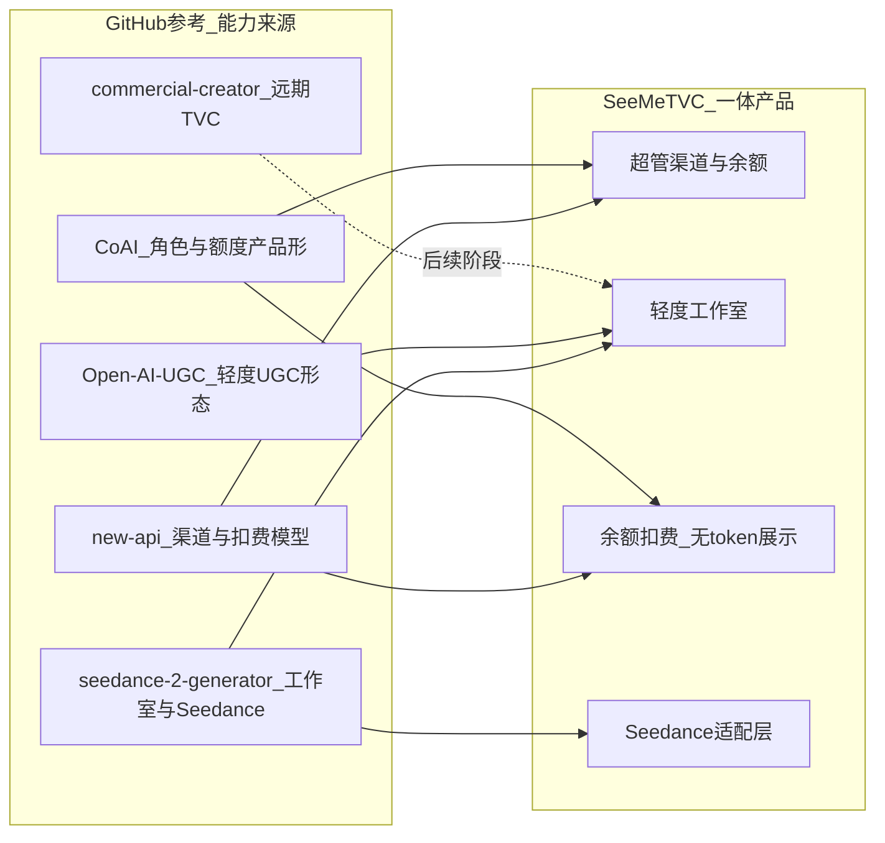
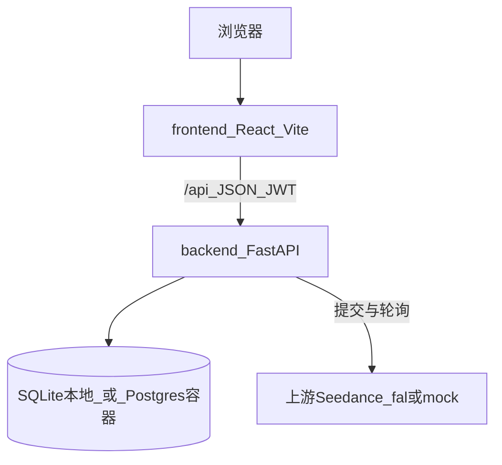

# SeeMeTVC 细化方案

> 状态：MVP 骨架已落地（FastAPI + React，一体单仓）。  
> 原则：**参考开源能力，内嵌进一个完整项目**；不分布式挂载 new-api 等外部计费层。

---

## 1. 目标与边界

### 1.1 要做什么

| 能力 | 说明 |
|------|------|
| 前后端分离 | 代码上 `frontend/` + `backend/`；部署一体（compose 或本地双进程） |
| 轻度工作流 | 表单式：选模型 → 提示词/参考图 → 时长 → 生成 → 轮询结果 |
| Seedance | 后端对接上游（默认 Lite，预留 2.5）；本地用 mock 可联调 |
| 用户侧余额 | 只展示余额、消耗、余额变化；**不展示 token** |
| 超管 token 来源 | 超管添加上游渠道（API Key / 模型 / 每秒扣费 / 启停） |
| 一体交付 | 一个仓库、一套编排；不为计费再拆第二个网关服务 |

### 1.2 明确不做（当前阶段）

- 不部署独立 `new-api` / One API 作为计费层
- 不做后台 token 审计 / 明细账本 UI
- 不做完整 TVC 重流水线（Brief→分镜→审批→成片）
- 不做 Stripe / 第三方支付（余额由超管设置）

---

## 2. 五个 GitHub 参考项目

以下五个项目是方案与实现的主要参考来源。**只吸收能力与交互模型，不作为运行时依赖。**

| # | 项目 | 链接 | 参考什么 | 本项目如何吸收 |
|---|------|------|----------|----------------|
| 1 | **new-api** | [QuantumNous/new-api](https://github.com/QuantumNous/new-api) | 超管「渠道」：多上游 Key、模型映射、启停/优先级、按量扣费 | 内嵌 `Channel` 表 + `/api/admin/channels`；**不**单独跑 new-api |
| 2 | **seedance-2-generator** | [SamurAIGPT/seedance-2-generator](https://github.com/SamurAIGPT/seedance-2-generator) | Seedance 在线工作室、t2v/参考图、异步任务、积分式消费 UX | 工作室页 + 生成/轮询；积分改为「余额」；去掉 Stripe |
| 3 | **Open-AI-UGC** | [Anil-matcha/Open-AI-UGC](https://github.com/Anil-matcha/Open-AI-UGC) | 自托管 UGC/广告短片工作室形态、换模型、轻量参数面板 | 页面信息架构：工作室 / 记录；模型列表来自已启用渠道 |
| 4 | **CoAI（原 ChatNio）** | [coaidev/coai](https://github.com/coaidev/coai) | 前后端可分离产品形态、超管后台、按用户额度 | 角色 `super_admin` / `user`；超管改余额；用户只看余额 |
| 5 | **commercial-creator** | [cxbxmxcx/commercial-creator](https://github.com/cxbxmxcx/commercial-creator) | TVC 商业片阶段划分、Seedance 成片、费用闸门 | **仅作后续扩展蓝图**；当前不实现重流水线，避免违背「轻度」 |

### 2.1 参考关系示意



### 2.2 为何不是「五个仓库拼起来部署」

| 方式 | 问题 |
|------|------|
| new-api + 前端分部署 | 运维两套系统，密钥/用户体系割裂 |
| 直接 fork seedance-2-generator | 缺超管多渠道；Stripe 与「余额」产品语义不符 |
| 直接用 commercial-creator | 流水线过重，不符合轻度工作流 |

结论：五个项目是**设计输入**；产出是 **SeeMeTVC 单仓**。

---

## 3. 当前技术架构

### 3.1 总览



| 层 | 技术 | 职责 |
|----|------|------|
| 前端 | React 19 + Vite + React Router | 登录、工作室、记录、超管 |
| 后端 | FastAPI + SQLAlchemy asyncio | 鉴权、渠道、余额扣/退、任务编排 |
| 数据 | 本地默认 SQLite；compose 用 Postgres 16 | 用户、渠道、任务 |
| 上游 | `provider=mock` 或 `fal` | Seedance Lite / 2.5（路径可配） |
| 部署 | `docker-compose.yml`：web + api + db | 一体拉起；开发可无 Docker |

### 3.2 目录结构

```text
SeeMeTVC/
├── backend/
│   ├── app/
│   │   ├── main.py              # 应用入口、CORS、建表、bootstrap
│   │   ├── config.py            # 环境配置
│   │   ├── db.py / models.py    # 异步引擎与 ORM
│   │   ├── security.py / deps.py
│   │   ├── api/
│   │   │   ├── auth.py          # 注册登录 /me
│   │   │   ├── channels.py      # 模型列表 + 超管渠道 CRUD
│   │   │   ├── videos.py        # 生成、任务查询、扣费/退款
│   │   │   └── admin_users.py   # 用户列表、设置余额
│   │   └── services/seedance.py # 上游适配（mock / fal）
│   ├── requirements.txt
│   └── Dockerfile
├── frontend/
│   ├── src/
│   │   ├── pages/               # Login / Studio / History / Admin
│   │   ├── api.ts / auth.tsx
│   │   └── App.tsx
│   └── Dockerfile               # 构建 + nginx 反代 /api
├── docker-compose.yml
├── 细化方案.md                  # 本文
└── README.md
```

### 3.3 核心数据模型

| 实体 | 关键字段 | 用途 |
|------|----------|------|
| `User` | email, role, **balance**, is_active | 角色 + 余额（用户可见） |
| `Channel` | name, provider, api_key, model_id, upstream_model, cost_per_second, priority, enabled | 超管维护的 token 来源 |
| `VideoJob` | prompt, model_id, duration, status, **cost**, **balance_after**, result_url | 任务与用户可理解的余额轨迹 |

用户历史只暴露：`cost`、`balance_after`、状态、结果；不暴露上游 token / Key。

### 3.4 关键 API

| 方法 | 路径 | 谁用 | 说明 |
|------|------|------|------|
| POST | `/api/auth/register` `/login` | 公开 | 注册默认送余额；登录发 JWT |
| GET | `/api/auth/me` | 用户 | 含 `balance`、`balance_unit` |
| GET | `/api/models` | 用户 | 已启用渠道去重后的模型列表 |
| POST | `/api/videos/generate` | 用户 | 预扣余额 → 建任务 → 后台跑上游 |
| GET | `/api/videos/jobs` | 用户 | 历史（余额视角） |
| CRUD | `/api/admin/channels` | 超管 | 添加/改/启停上游 Key |
| PATCH | `/api/admin/users/{id}/balance` | 超管 | 设置余额 |

### 3.5 生成与扣费时序

```mermaid
sequenceDiagram
  participant U as 用户
  participant FE as 前端
  participant API as FastAPI
  participant DB as 数据库
  participant UP as Seedance或mock

  U->>FE: 提交生成
  FE->>API: POST /videos/generate
  API->>DB: 选最高优先级启用渠道
  API->>DB: balance -= cost; 写 VideoJob
  API-->>FE: job 含 cost 与 balance_after
  API->>UP: submit + poll
  alt 成功
    UP-->>API: result_url
    API->>DB: status=succeeded
  else 失败或超时
    API->>DB: 退回 cost; status=refunded
  end
  FE->>API: 轮询 GET /jobs/{id}
  FE-->>U: 播放视频; 刷新余额
```

扣费公式（当前）：

```text
cost = channel.cost_per_second × duration_seconds
```

### 3.6 前端信息架构

| 页面 | 职责 | 用户可见计费信息 |
|------|------|------------------|
| 登录/注册 | JWT | 无 |
| 工作室 | 模型、提示词、时长、生成、结果播放 | 预计消耗、当前余额、本单消耗与余额 |
| 记录 | 任务列表 | 消耗、余额、状态（无 token） |
| 管理（超管） | 渠道 CRUD、用户改余额 | Key 脱敏展示 |

### 3.7 部署形态

```text
开发（当前常用）
  Vite :5173  ──proxy──►  Uvicorn :8000  ──►  SQLite

生产（compose）
  Nginx(web) ──/api──►  api  ──►  Postgres
                 └──静态──►  frontend dist
```

本机无 Docker 时：后端默认 `sqlite+aiosqlite:///./seemetvc.db`。

---

## 4. 与参考项目的能力对照（落地进度）

| 需求点 | 参考来源 | MVP 现状 |
|--------|----------|----------|
| 超管加 token 来源 | new-api | 已有 Channel CRUD + 脱敏 |
| Seedance Lite / 2.5 | seedance-2-generator | 渠道可配 model_id；bootstrap 含 lite(mock)+2.5(未启用) |
| 轻度工作室 | seedance-2-generator / Open-AI-UGC | 已有 t2v + 可选 image_url |
| 按用户计费感知 | CoAI / seedance 积分 | **改为余额**；记录含 balance_after |
| 一体部署 | — | 单仓 + compose；能力内嵌 |
| TVC 重流水线 | commercial-creator | 未做（有意推迟） |
| Token 审计后台 | new-api 用量看板 | **明确不做（当前）** |

---

## 5. 默认账号与联调说明

| 项 | 值 |
|----|-----|
| 超管 | `admin@example.com` / `admin123456` |
| 默认渠道 | `seedance-lite`（provider=`mock`，可播演示片） |
| 真实成片 | 管理页新增/启用 `provider=fal` 渠道并填 Key |
| 健康检查 | `GET /api/health` |

mock 成功时返回公开样例 MP4，用于验证播放器与扣费闭环；**不是** Seedance 真实输出。

---

## 6. 后续迭代建议（按优先级）

### P1 — 产品可用

1. fal 渠道参数对齐官方（分辨率、宽高比、i2v 字段）
2. 结果视频落本地/对象存储，避免上游 URL 过期
3. 任务列表支持重试、失败原因更友好
4. 超管：渠道编辑完整表单（改 Key、改倍率）而非仅启停

### P2 — 轻度工作流加深

1. 两步流：主题 → 自动出脚本/提示词 → 确认后再生成（仍保持轻度）
2. 模板（商品广告 / 口播 / 氛围片）与推荐时长
3. 参考图上传（现仅 URL）

### P3 — 吸收 commercial-creator（可选）

仅当业务需要「广告片管线」时分阶段加：脚本 → 分镜 → 生成 → 简单 QC；每阶段仍走同一余额模型，不引入第二套计费服务。

### 明确继续不做

- 独立 new-api 网关进程
- 用户侧 token 数字与审计大盘（除非产品改口）

---

## 7. 一句话结论

SeeMeTVC = **参考 new-api 的渠道治理 + seedance-2-generator / Open-AI-UGC 的轻度视频工作室 + CoAI 的超管/额度产品形**，做成 **FastAPI + React 一体单仓**；**commercial-creator** 仅作为远期 TVC 扩展参考。用户只理解「余额」，超管只配置「上游 Key 从哪来」。
