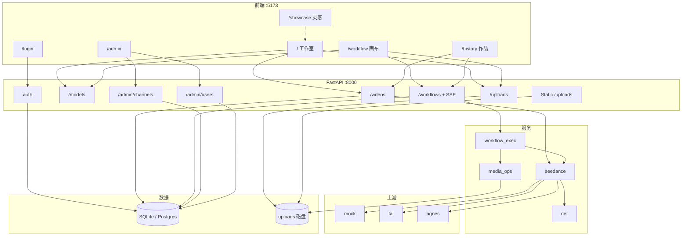

# SeeMeTVC 细化方案

美妆 TVC 一体仓：FastAPI + React。需求见 [项目计划书.md](项目计划书.md)（本文件不改计划书）；路线 / 能力边界 / 架构以本方案为准。画布节点与提示词细节以代码为准（`frontend/src/workflow/`、`backend/app/services/workflow_exec.py`）。

---

## 0. 路线：下一个里程碑与暂且搁置

| 档 | 内容 |
|----|------|
| **下一个里程碑** | 声音工作流：音频节点（上传可播）+ ffmpeg 混进成片，官方模板接上 |
| 暂且搁置 | 多项目空间（画布已可命名保存多份草稿；此处指完整项目空间与资产组织） |
| 暂且搁置 | 复杂画布手势（框选、对齐、批量复制等） |
| 暂且搁置 | 素材库抽屉（历史作品/素材点选上画布） |
| 已下线 | 阶段流 / 分镜墙（路由重定向到主画布） |
| 暂且搁置 | 文本草案接真 LLM（现为本地模板拼装） |
| 暂且搁置 | TTS 口播、曲库/版权、多轨精剪 |
| 上线前加固 | 资金与安全（密钥保管、退款边界、权限、限流）——本地已有鉴权/余额/失败退款，上线前需加固，不挡画布迭代 |

---

## 1. 现在能做什么

| 入口 | 干什么 |
|------|--------|
| `/` 工作室 | 一键快出片（可并行多 Job） |
| `/workflow` 画布 | 专业编排：模板一键、自由节点连线、单飞执行（同时一只 Run）、SSE、trim/拼接、超管模拟 |
| `/showcase` 灵感 | Lookbook 浏览；同款提示词在工作室素材墙可一键套用 |
| `/history` 作品 | 工作室 Job + 画布 Run 成片回看 |
| `/admin` 超管 | 渠道 / Key / 用户余额 |
| `/login` | 登录 / 注册 |

本地：Web `5173`，API `8000`（默认 SQLite）；Docker Compose 为 nginx + API + Postgres，镜像内含 ffmpeg。

上游：`mock`（本地样片，依赖 ffmpeg）/ `fal` / `agnes`（免费档易 429）。默认 heal 启用 mock 且优先级高于 Agnes。

---

## 2. 现在的架构

工作室与画布共用 Channel 计费、seedance、上传；画布另用 ffmpeg 与 run SSE。

