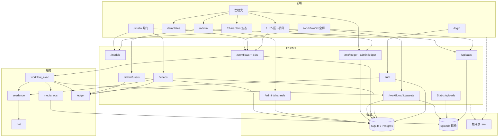

# SeeMeTVC 细化方案

美妆 TVC 一体仓：FastAPI + React。需求见 [项目计划书.md](项目计划书.md)（**本仓库不改计划书**）。**本文件是现行路线**（v3 换壳、账本、项目空间均已落地）。

视觉 IA 对齐 [原型图.html](原型图.html)。节点与执行以 `frontend/src/workflow/`、`backend/app/services/workflow_exec.py` 为准。账本以 `backend/app/services/ledger.py` 为准。项目素材以 `project_assets` / `/api/workflows/:id/assets` 为准。主机与端口以仓库根目录 [`.env.example`](.env.example) 为准。

实现时同步 [README.md](README.md) 与原型。

---

## 0. 路线

现行维护项目主路径；声音排在这之后。

| 档 | 内容 |
|----|------|
| **现行（已落地）** | 工作区 = **我的项目**（1 项目 = 1 张编辑画布）；无 `/history`；成片只在该项目；Run 失败即删、成功覆盖；左侧「节点 \| 素材」；空画布一键跑先说明原因；公共 `.env`；账本 append-only |
| **下一个里程碑** | **声音工作流**：`AudioAsset` + ffmpeg 混音；官方模板接音频槽。画布仍只跑一只 Run |
| 暂且搁置 | 素材文件夹/标签；引用式跨项目复用（现网只有**文件复制**） |
| 暂且搁置 | 复杂画布手势（框选、对齐、批量复制）；一级人物库（`/characters` 空态）；设置面板 |
| 暂且搁置 | 文本草案接真 LLM；TTS / 曲库 / 多轨精剪 |
| 暂且搁置 | 画布视觉重构（胶囊顶栏、自绘 minimap）；现网仍是 xyflow + 左栏 Tab |
| 已下线 | 阶段流 / 分镜墙（`/workflow/stage` 等仍重定向）；**全局历史页**；工作室一键出片退出主路径（`/studio` 暗门仍在） |
| 上线前加固 | 密钥保管、退款边界、权限、限流 |

声音开工前若分叉未拍（混音接 Mux 还是成片节点、BGM vs 口播），先 grill 再改本文件。

---

## 1. 三个词（不要并成一个）

用户能保存、打开、删除的**只有项目**。模板和画布不是第二种资产。

| 词 | 是什么 | 现网 |
|----|--------|------|
| **项目** | 用户拥有的工作 | `workflows` 一行：名称、品牌、节点图、素材、封面。入口「我的项目」 |
| **画布** | 打开项目后的编辑界面 | `/workflow/:id` 全屏 xyflow。不是独立对象 |
| **模板** | 只读配方 | `frontend/src/workflow/templates.ts` + Lookbook。点一下 = **新建项目** |

左栏「工作区」是项目列表；「模板」是新建入口，不是资产库。顶栏进编辑器后显示项目名，不要把「画布」当成和项目平级的标题。

空白新建 = 模板 `quick_shot`（Brief + 图 + 一镜），不是零节点。零节点项目可以保存，但「一键跑」会直接提示原因、不创建 Run。画布内套用模板只换节点图，**不改项目名**。

---

## 2. 现在能做什么

壳层：深色 **84px** 左栏 + 顶栏（标题、余额芯片、账号）。玫瑰 / 珍珠色跟原型。打开项目后全屏盖住壳（无左栏）；xyflow 工具条保留，不重做独立 dock / 自绘 minimap。

| 入口 | 干什么 |
|------|--------|
| `/login` | 登录 / 注册。开发构建可按 `.env` 预填超管；生产包不预填 |
| `/` 工作区 | **我的项目**：网格（无列表视图）、搜索名称/品牌、状态筛选；新建 / 复制 / 删除（二次确认）/ 打开。封面 = 成片，否则最后一张图片 |
| `/templates` | 官方模板 + Lookbook（`beautyAssets.ts`）；选用或点同款 → 新建项目并打开；同款提示词写入 Brief，不套到 `/studio` |
| `/characters` | 空态：回工作区，或用「美妆线性链路」新建项目。妆造节点或素材 Tab 上传肖像 |
| `/history` | **重定向 → `/`** |
| `/workflow/:id` | 该项目：名称、保存、一键跑、取消、SSE、trim/拼接、超管模拟；左侧 **节点 \| 素材**。无项目切换列表。「← 工作区」返回 |
| `/admin` | 渠道 / Key / 用户余额 / 该用户流水（仅 `super_admin` 见左栏） |
| `/studio` | 暗门一键出片（不进左栏，不进任何列表） |
| `/showcase` | 重定向 → `/templates` |
| 裸 `/workflow`、`/workflow/stage` 等 | 重定向 → `/` |

本地开发：Web `WEB_PORT`（默认 5173），API `API_PORT`（默认 8000，SQLite）。Docker Compose：nginx + API + Postgres，镜像内含 ffmpeg。

上游：`Seedance LocalSimulate`（`model_id` = `seedance-local-simulate`）/ `ark`（Lite + 2.5）/ `agnes`。Key **只在渠道表**，超管「改 Key」，不进 `.env`。

一键跑事前检查（前后端一致）：没有节点 / 没有可出片节点 / 没有可用模型 → 横幅说明原因，不创建 Run。

---

## 3. 现在的架构

浏览器默认同源相对路径 `/api`、`/uploads`（Vite 开发代理或 nginx 反代）。分域部署设 `VITE_API_BASE`。API 读本地 `/uploads` 磁盘，不默认回环自己。CORS 默认反射 Origin（`CORS_ORIGINS=*`）。

---

## 4. 项目口径（已落地）

- **1 项目 = 1 张画布**。实现层仍是 `Workflow`（`/api/workflows`，URL `/workflow/:id`）；产品文案叫**项目**。不另建项目表。`workflows.brand`、`cover_url` 入库。
- 工作区卡片：名称 / 更新时间来自行本身；品牌优先 `workflows.brand`（不再只靠 graph）；画幅仍从 graph 推导（缺则 `16:9`）。不做「72% 节点就绪」。
- 状态：「进行中」= 尚无成功 Run；「已完成」= 当前成功 Run。从未跑过显示「未出片」。
- 素材挂 `project_assets.workflow_id`。类型：`image` / `video` / `output`。扁平列表 + 类型筛选。无文件夹。
- 画布用过的上传与成功成片 **自动进库**；素材 Tab 可直接上传图/视频（成片不手传）。跨项目 = **复制文件**；成片复制到对方库记为 `video`。
- 成片回看：工作区卡片 + 画布成片节点。无成片时卡片用该项目**最后一张图片**。无全局成片墙。
- Run：失败/取消立刻删行；成功则覆盖，该项目只留当前成功 Run；库里成片也只留最新。账本不删。
- 复制：新项目，名称 = `原名 副本`。删除：二次确认后删画布、该项目 Run、素材行及对应上传文件。
- 官方模板：`beauty_linear` / `standard` / `quick_shot`。
- 一次性迁移 `project_space_v1`：保留已有成片或已有图片的旧草稿；既无成片也无图的删除。此后仍可新建尚未出片的项目。

---

## 5. 余额流水（已落地）

append-only 表 `balance_entries`。**每次** `User.balance` 变动写一行，使账本加总能对上余额（期初之后）。0 元变动也记账（本地模拟可对账）。

| 事件 | 方向 | 说明 |
|------|------|------|
| 项目出片每镜扣费 | 负 | 与 `workflow_exec` 扣费点同步 |
| 项目出片每镜失败退款 | 正 | 同上 |
| 项目出片整单退（失败/取消） | 正 | 与现退款点同步 |
| 暗门工作室 Job 扣费 / 失败退款 | 负 / 正 | `/videos` 仍会改余额 |
| 超管 `PATCH` 余额 | 正或负 | 记 **差额**（新值 − 旧值） |
| 注册赠送 | 正 | 与现注册送分同步 |
| **期初** | 正（或零） | 部署时每用户一行，金额 = **当时** `User.balance` |

旧 `VideoJob` / `WorkflowRun` 的 `cost` **不回填**进账本（避免与期初双计）。Run 删除后账本行保留（`ref_id` 可空号）。

### API / UI

- 用户：`GET /api/me/ledger`；点顶栏余额芯片弹出层。**不**新增左栏「账单」页。
- 超管：`GET /api/admin/users/:id/ledger`。
- 行：时间、signed amount、变动后余额、类型、标题、可选 `ref_type` / `ref_id`（run / job / admin / grant / opening）。
- 弹层一镜一行——接受，不做按 Run 合并净额。
- 期初：启动或首次读流水时为尚无期初的用户补一行；**补期初窗口不要同时跑生成**。

---

## 6. 声音里程碑（本轮之后）

目标：成片能带上用户上传的音频。

| 项 | 说明 |
|----|------|
| 节点 | `AudioAsset`：上传、画布内可播 |
| 执行 | ffmpeg 混入成片（接 Mux 或成片节点，开工前 grill） |
| 模板 | 官方模板接音频槽；无音频时与现在一致 |
| 不计 | TTS、曲库、多轨精剪、版权检索 |

---

## 7. 明确不做（相对本文件）

- 改 [项目计划书.md](项目计划书.md)
- 下线 `/studio` 或删除 `video_jobs`
- 素材文件夹/标签、引用式复用
- 一级人物库、设置页
- 流水弹层按 Run 合并净额
- 支付 / 充值网关
- 把模板或画布也改名叫「项目」
- 回填旧 Job / Run 进账本

---

## 8. 已知缝与风险

- 壳是 v3，编辑器仍是 xyflow；素材是左栏 Tab，不是原型里独立 dock。
- 覆盖式成片不可后悔；要留旧版须先复制到其他项目。
- 无全局搜索旧片。
- `/studio` 仍扣费，不进任何列表页。
- 期初写入时不要同时跑生成。
- 主机、端口、超管预填只改根目录 `.env`；`backend/.env` 仅覆盖（如本机 `FFMPEG_PATH`）。
