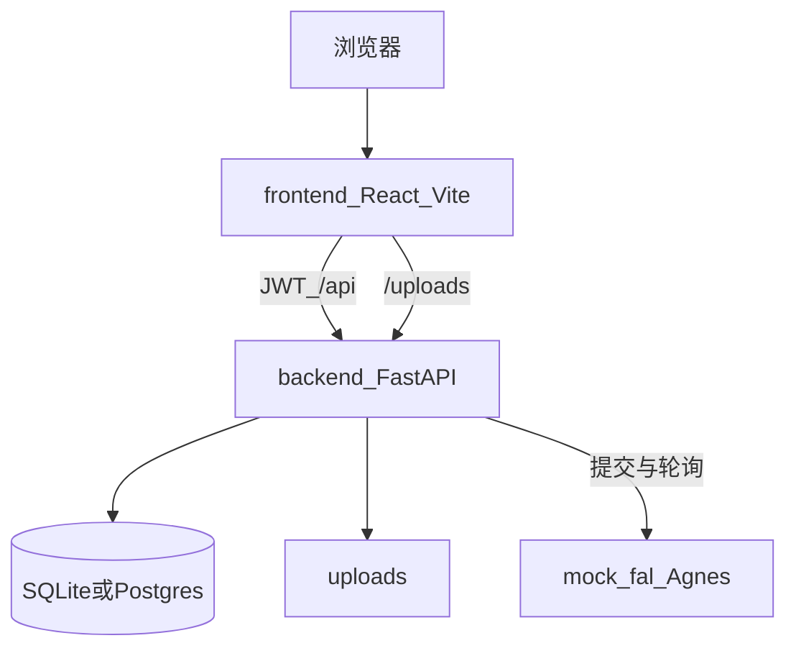
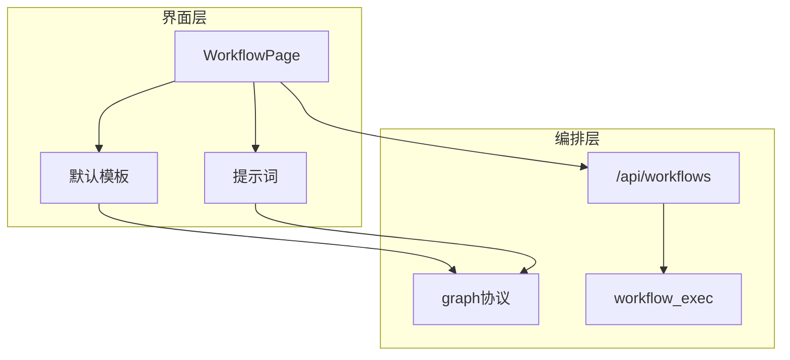
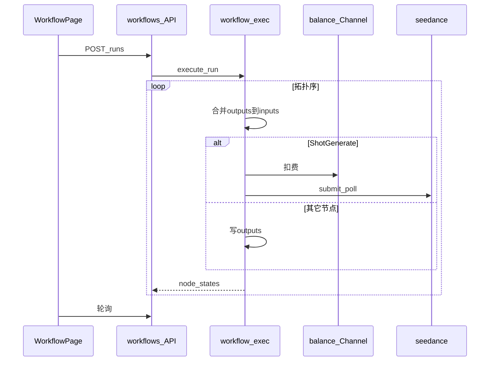

# SeeMeTVC 细化方案

本项目是美妆 TVC 一体仓，技术栈是 FastAPI + React。

下一步目标：工作流体验对齐 [AIYOU](https://github.com/yubowen123/AIYOU_open-ai-video-drama-generator)。要对齐的能力包括：模板铺图、节点传数、提示词、执行状态、局部重跑。

明确不做：短剧平台、嵌入 ComfyUI、单独部署 new-api。

公网上线前必须完成 §6。本地开发工作流时，不必等 §6 全部完成。

产品需求见 [项目计划书.md](项目计划书.md)。

---

## 0. 接下来做什么

| 优先级 | 内容 | 章节 |
|--------|------|------|
| **主线** | 工作流对齐 AIYOU | §4、§5 |
| 已有 | 整仓架构，继续沿用 | §2、§3 |
| 上线前 | 资金与安全修复 | §6 |

开发顺序如下：

1. 模板铺图  
2. 端口联动和提示词  
3. 局部重跑  
4. LLM 分镜  
5. 真拼接和 WebSocket  

---

## 1. 做什么、不做什么

| 做 | 不做 |
|----|------|
| 采用 AIYOU 的画布、连线、模板、提示词、节点状态 | 短剧 12 节点、中继 API、桌面端 |
| 继续使用本仓 React Flow、`workflow_exec`、Channel 余额 | ComfyUI 进程、new-api、用户侧 token、Stripe |

工作流交互以 AIYOU 为主要参考。TVC 阶段划分可参考 commercial-creator。

渠道和工作室的能力，已经吸收了 new-api、CoAI、seedance 等项目的做法。这些项目不再作为运行时依赖。

---

## 2. 当前整仓架构

前端与后端分开开发，一起部署。

用户侧只显示余额，不显示 token。超管配置 Channel。当前支持的上游：`mock`、`fal`、`agnes`。

### 2.1 运行结构



| 层 | 技术 | 职责 |
|----|------|------|
| 前端 | React + Vite + React Flow | 登录、工作室、工作流、素材、作品、超管 |
| 后端 | FastAPI | 鉴权、渠道、余额、出片任务、工作流执行、上传 |
| 数据库 | 本地用 SQLite；compose 用 Postgres | 用户、渠道、任务、工作流 |
| 上游 | mock / fal / agnes | 生成视频。本机图片先转成 data URI，再提交上游 |
| 部署 | docker-compose：web + api + db | 开发环境也可前后端双进程启动 |

### 2.2 目录

```text
SeeMeTVC/
├── backend/app/
│   ├── main.py / config.py / db.py / models.py
│   ├── api/          # auth, channels, videos, workflows, uploads, admin_users
│   └── services/     # seedance.py, workflow_exec.py, net.py
├── frontend/src/
│   ├── pages/        # Login, Studio, Workflow, Showcase, History, Admin
│   └── components/
├── docker-compose.yml
├── 细化方案.md
└── 项目计划书.md
```

### 2.3 数据和接口

| 实体 | 用途 |
|------|------|
| `User.balance` | 用户余额 |
| `Channel` | 上游 Key、模型、每秒单价 |
| `VideoJob` | 工作室的一次生成任务 |
| `Workflow` | 工作流草稿 |
| `WorkflowRun` | 一次执行记录，含节点状态 |

| 能力 | 接口 |
|------|------|
| 登录 | `POST /api/auth/register`、`POST /api/auth/login`、`GET /api/auth/me` |
| 渠道 | `GET /api/models`；超管 `CRUD /api/admin/channels` |
| 工作室 | `POST /api/videos/generate`、`GET /api/videos/jobs` |
| 上传 | `POST /api/uploads/images` |
| 工作流 | `CRUD /api/workflows`、`POST /api/workflows/runs`、`GET /api/workflows/runs` |
| 改余额 | `PATCH /api/admin/users/{id}/balance` |

计费公式：`费用 = 每秒单价 × 秒数`。

生成失败时，状态记为 `refunded`，并退回已扣余额。

默认每用户最多同时跑 3 个任务。

### 2.4 页面和部署

| 地址 | 页面 | 当前定位 |
|------|------|----------|
| `/` | 工作室 | 一键出片。本阶段维持现状 |
| `/workflow` | 工作流 | 下一阶段的主开发面 |
| `/history` | 作品 | 维持 |
| `/showcase` | 素材 | 维持 |
| `/admin` | 超管 | 配置渠道和余额 |
| `/login` | 登录 | 维持 |

```text
开发:  Vite :5173 → 代理到 Uvicorn :8000 → SQLite + uploads
生产:  Nginx → api → Postgres + uploads
```

环境变量见 `backend/.env.example`。联调账号见 §7。

---

## 3. 整仓架构与工作流架构的关系

整仓提供底座能力：登录、余额、渠道、上传、出片。

工作流是底座之上的编排界面。

对齐 AIYOU 时，只改画布交互和节点数据传递。不新建一套账号系统，也不新建一套计费系统。

```mermaid
flowchart TB
  subgraph platform [整仓底座]
    auth[JWT]
    bill[余额]
    ch[Channel]
    up[上传]
    sd[seedance]
    studio[工作室]
  end

  subgraph wf [工作流]
    canvas[WorkflowPage]
    graph[graph_json]
    run[WorkflowRun]
    exec[workflow_exec]
  end

  canvas --> graph
  canvas --> run
  run --> exec
  exec --> bill
  exec --> ch
  exec --> up
  exec --> sd
  studio --> bill
  studio --> sd
  auth --> canvas
  auth --> studio
```

关系说明：

1. 工作室与工作流共用同一套余额和 Channel。  
2. 工作室用于单次镜头生成。工作流用于多节点完整链路，交互对齐 AIYOU。  
3. 下一阶段主要改工作流相关代码。底座以修缺陷和完成 §6 为主。  
4. 不把工作流拆成独立服务。

---

## 4. 工作流如何对齐 AIYOU

视频生成仍走本仓路径：`ShotGenerate` → Channel → `seedance.py`。不接入 AIYOU 的中继 API。

### 4.1 工作流分层



| 层 | 代码位置 |
|----|----------|
| 界面层 | `WorkflowPage.tsx`。后续拆出模板、提示词、节点组件 |
| 编排层 | `api/workflows.py`、`services/workflow_exec.py` |
| 底座 | 余额、Channel、上传、seedance。见 §3 |

### 4.2 AIYOU 能力映射

| AIYOU 能力 | 本仓落点 |
|------------|----------|
| 画布和节点 | `WorkflowPage`，以及 §4.4 的 6 个美妆节点 |
| 连线传数据 | `edges`、`outputs`、`inputs`；由 `workflow_exec` 在执行时合并 |
| 一键模板 | 打开页面即加载默认链路；用户可另存为 `Workflow` |
| 提示词 | 前端内置妆前、妆后、slogan 片段 |
| 执行状态 | 用 `node_states_json` 更新画布；再实现局部重跑 |
| 智能分镜 | `ScenePlan`。先用模板，再可选 LLM。LLM 走 Channel 并扣余额 |
| 视频中继 | 不采用。统一走 Channel 与 `seedance` |

### 4.3 图数据格式

当前格式：节点只有 `data`，边只有 `source` 和 `target`。

目标格式：节点增加 `outputs`；边增加 `sourceHandle` 和 `targetHandle`。

兼容要求：没有 ports 字段的旧图仍可执行。

### 4.4 六个节点

| 节点 | 对齐的 AIYOU 能力类型 | 产出 |
|------|----------------------|------|
| `BriefInput` | 创意输入 | `brief` |
| `ScenePlan` | 拆分镜 | `scenes[]` |
| `MakeupControl` | 妆效约束 | `makeup` |
| `ShotGenerate` | 生成视频 | `clips[]` |
| `TimelineMux` | 合成时间线 | `timeline`。当前不做真实 ffmpeg |
| `PreviewOut` | 预览结果 | `result_url` |

后续可增加主角选择、slogan 落点节点。

不增加短剧剧本节点、角色九宫格节点。

### 4.5 一次执行过程



整次运行失败时，已扣费用全部退回，状态为 `refunded`。

局部重跑见 §5 第 3 步。

---

## 5. 开发顺序

按下列顺序实现。优先改工作流界面和 `workflow_exec`。底座代码仅在阻塞工作流时修改。

| 序 | 做什么 | 改哪里 |
|----|--------|--------|
| 1 | 模板一键铺图，以及右侧参数面板 | 前端默认图；可保存为 `Workflow` |
| 2 | 端口联动和提示词 | §4.3；`workflow_exec` 合并上游输出；前端提示词表 |
| 3 | 局部重跑 | `POST /runs/{id}/rerun`。依赖 §6 的原子扣费 |
| 4 | LLM 分镜 | `ScenePlan` 调用文本 Channel，输出 `scenes[]` |
| 5 | 真拼接和进度推送 | ffmpeg；用 WebSocket 替代高频轮询 |

仅在下列情况处理配套项：阻塞主线开发，或准备上线。配套项包括：时长计费对齐、超时与队列、结果落盘、§6、扣费测试。

更远期功能：品牌模板、主角库、订阅。仍不做短剧平台。

---

## 6. 上线前必须修

下表为公网上线前的必修项。

本地开发工作流时，不必等本表全部完成。

| # | 问题 | 修法 |
|---|------|------|
| 1 | 余额可被并发透支 | 使用原子更新：`UPDATE … WHERE balance >= :cost` |
| 2 | 用 Float 记账不准确 | 改为 Numeric，或改为整数分 |
| 3 | 后台任务崩溃后钱已扣不退 | 启动时扫描并退回僵尸任务；后续再上任务队列 |
| 4 | 删除渠道后进行中任务不退款 | 失败分支退款；渠道改为软删除，或拦截仍有进行中任务的删除 |
| 5 | 参考图回源存在 SSRF | 拒绝私网地址 |
| 6 | nginx 默认 1MB，上传 10MB 会失败 | 设置 `client_max_body_size 12m` |
| 7 | 本机 `.env` 可能含真实 Key | 轮换 Key |
| 8 | 注册送余额且无限流 | 收紧赠额；登录与注册加限流 |
| 9 | JWT 与超管使用默认密钥 | 启动时检查；改用 secrets；缩短 token 有效期 |

P1：Agnes 按 `num_frames` 计费、上传文件头校验、渠道 Key 加密、工作流草稿归属校验。

P2：alembic、扣费 pytest、SQLite 锁问题。

---

## 7. 联调附录

| 项 | 值 |
|----|-----|
| 超管 | `admin@example.com` / `admin123456` |
| 默认渠道 | `seedance-lite`（mock） |
| Agnes | 配置 `AGNES_API_KEY`。国内建议 `https://api.agnes-ai.cn` |
| 健康检查 | `GET /api/health` |

---

## 8. 小结

§2 描述已落地的整仓架构。  
§3 说明工作流如何挂在整仓底座上。  
§4 和 §5 说明如何按 AIYOU 完成工作流。  
§6 是公网上线前的安全与资金门禁。
